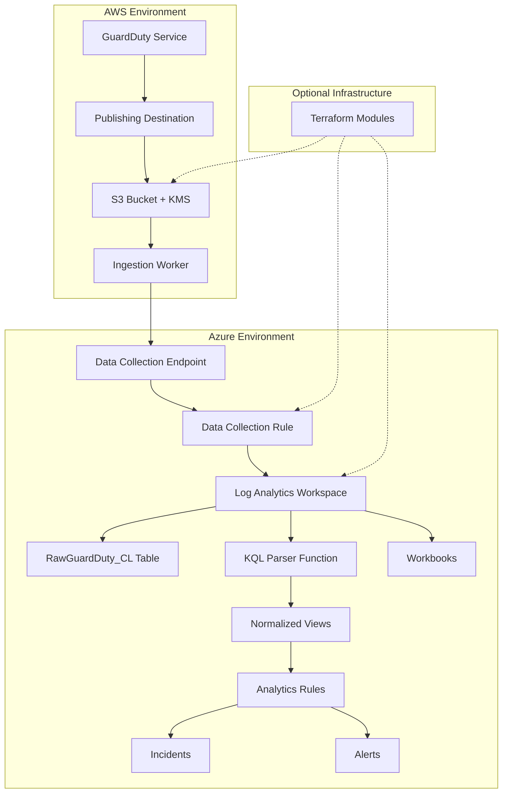

# Design Document: GuardDuty to Sentinel Integration

## Overview

This system provides end-to-end integration between AWS GuardDuty threat detection and Azure Sentinel SIEM, enabling centralized security operations across hybrid cloud environments. The architecture follows Azure's modern Logs Ingestion API patterns using Data Collection Rules (DCR) and supports both raw and normalized data ingestion modes.

The system processes GuardDuty findings exported to S3, transforms them as needed, and ingests them into Azure Monitor Logs for analysis, correlation, and incident response through Sentinel analytics rules.

## Architecture



## Components and Interfaces

### AWS Components

#### GuardDuty Publishing Destination
- **Purpose**: Exports GuardDuty findings to S3 bucket automatically
- **Configuration**: Uses `aws_guardduty_publishing_destination` resource
- **Export Format**: JSON findings exported within 5 minutes of generation
- **Frequency**: Configurable (default 6 hours for updated findings)

#### S3 Export System
- **Bucket Structure**: `s3://bucket/prefix/AWSLogs/{account-id}/GuardDuty/{region}/`
- **File Format**: `{UUID}.jsonl.gz` (compressed JSON Lines)
- **Encryption**: AWS KMS encryption with GuardDuty service principal access
- **Retention**: Configurable based on compliance requirements

#### KMS Key Policy
```json
{
    "Sid": "AllowGuardDutyKey",
    "Effect": "Allow",
    "Principal": {
        "Service": "guardduty.amazonaws.com"
    },
    "Action": "kms:GenerateDataKey",
    "Resource": "KMS key ARN",
    "Condition": {
        "StringEquals": {
            "aws:SourceAccount": "{account-id}",
            "aws:SourceArn": "arn:aws:guardduty:{region}:{account-id}:detector/{detector-id}"
        }
    }
}
```

### Ingestion Worker

#### Architecture Options
1. **Azure Function**: Serverless, event-driven processing
2. **Container App**: Kubernetes-based, scalable processing
3. **Lambda-to-HTTP**: AWS Lambda posting to Azure endpoints

#### Core Functionality
- **S3 Object Processing**: Reads compressed JSONL files from S3
- **Batch Processing**: Configurable batch sizes (default 100 findings per batch)
- **Retry Logic**: Exponential backoff with configurable retry counts
- **Error Handling**: Dead letter queue for failed processing
- **Deduplication**: Optional finding ID-based deduplication

#### Configuration Interface
```typescript
interface WorkerConfig {
    batchSize: number;           // Default: 100
    maxRetries: number;          // Default: 3
    retryBackoffMs: number;      // Default: 1000
    enableNormalization: boolean; // Default: false
    deadLetterQueue?: string;
    azureEndpoint: string;
    dcr: {
        immutableId: string;
        streamName: string;
    };
}
```

### Azure Components

#### Data Collection Architecture
Following Azure's modern ingestion pattern (post-March 2024):
- **DCR with Built-in Endpoints**: No separate DCE required for new DCRs
- **Direct Ingestion**: Uses DCR's `logsIngestion` endpoint property
- **Authentication**: Service Principal with "Monitoring Metrics Publisher" role

#### Data Collection Rule (DCR)
```json
{
    "location": "eastus",
    "kind": "Direct",
    "properties": {
        "streamDeclarations": {
            "Custom-GuardDutyFindings": {
                "columns": [
                    {"name": "TimeGenerated", "type": "datetime"},
                    {"name": "FindingId", "type": "string"},
                    {"name": "AccountId", "type": "string"},
                    {"name": "Region", "type": "string"},
                    {"name": "Severity", "type": "real"},
                    {"name": "Type", "type": "string"},
                    {"name": "RawJson", "type": "string"}
                ]
            }
        },
        "destinations": {
            "logAnalytics": [{
                "workspaceResourceId": "/subscriptions/{sub}/resourceGroups/{rg}/providers/microsoft.operationalinsights/workspaces/{workspace}",
                "name": "LogAnalyticsDest"
            }]
        },
        "dataFlows": [{
            "streams": ["Custom-GuardDutyFindings"],
            "destinations": ["LogAnalyticsDest"],
            "transformKql": "source | extend TimeGenerated = now()",
            "outputStream": "Custom-RawGuardDuty_CL"
        }]
    }
}
```

#### Log Analytics Workspace Schema

**RawGuardDuty_CL Table**:
- `TimeGenerated`: Ingestion timestamp
- `FindingId`: GuardDuty finding identifier
- `AccountId`: AWS account ID
- `Region`: AWS region
- `Severity`: Numeric severity (0.0-8.9)
- `Type`: Finding type (e.g., "Trojan:EC2/DNSDataExfiltration")
- `RawJson`: Complete finding JSON for detailed analysis

#### KQL Parser Function
```kql
// GuardDutyNormalized() function
RawGuardDuty_CL
| extend ParsedJson = parse_json(RawJson)
| extend 
    CreatedAt = todatetime(ParsedJson.createdAt),
    UpdatedAt = todatetime(ParsedJson.updatedAt),
    Title = tostring(ParsedJson.title),
    Description = tostring(ParsedJson.description),
    Service = tostring(ParsedJson.service.serviceName),
    ResourceType = tostring(ParsedJson.resource.resourceType),
    InstanceId = tostring(ParsedJson.resource.instanceDetails.instanceId),
    RemoteIpCountry = tostring(ParsedJson.service.remoteIpDetails.country.countryName),
    RemoteIpAddress = tostring(ParsedJson.service.remoteIpDetails.ipAddressV4)
| project TimeGenerated, FindingId, AccountId, Region, Severity, Type, 
          CreatedAt, UpdatedAt, Title, Description, Service, ResourceType, 
          InstanceId, RemoteIpCountry, RemoteIpAddress, RawJson
```

## Data Models

### GuardDuty Finding Structure
Based on AWS documentation, GuardDuty findings contain:

```typescript
interface GuardDutyFinding {
    schemaVersion: string;
    accountId: string;
    region: string;
    partition: string;
    id: string;
    arn: string;
    type: string;
    resource: {
        resourceType: string;
        instanceDetails?: {
            instanceId: string;
            instanceType: string;
            availabilityZone: string;
            // ... additional instance details
        };
        s3BucketDetails?: {
            name: string;
            type: string;
            // ... additional S3 details
        };
    };
    service: {
        serviceName: string;
        detectorId: string;
        action?: {
            actionType: string;
            networkConnectionAction?: {
                connectionDirection: string;
                remoteIpDetails: {
                    ipAddressV4: string;
                    country: {
                        countryName: string;
                        countryCode: string;
                    };
                };
            };
        };
        evidence?: any;
        archived: boolean;
        count: number;
        eventFirstSeen: string;
        eventLastSeen: string;
        resourceRole: string;
    };
    severity: number;
    createdAt: string;
    updatedAt: string;
    title: string;
    description: string;
}
```

### Normalized Data Schema
The KQL parser extracts key fields into a flattened structure:

```typescript
interface NormalizedFinding {
    TimeGenerated: Date;
    FindingId: string;
    AccountId: string;
    Region: string;
    Severity: number;
    Type: string;
    CreatedAt: Date;
    UpdatedAt: Date;
    Title: string;
    Description: string;
    Service: string;
    ResourceType: string;
    InstanceId?: string;
    RemoteIpCountry?: string;
    RemoteIpAddress?: string;
    RawJson: string; // Preserved for detailed analysis
}
```

### Batch Processing Model
```typescript
interface ProcessingBatch {
    batchId: string;
    s3Objects: S3Object[];
    findings: GuardDutyFinding[];
    processedCount: number;
    failedCount: number;
    retryCount: number;
    status: 'pending' | 'processing' | 'completed' | 'failed';
}
```

## Correctness Properties

*A property is a characteristic or behavior that should hold true across all valid executions of a system—essentially, a formal statement about what the system should do. Properties serve as the bridge between human-readable specifications and machine-verifiable correctness guarantees.*

### Property 1: S3 Export Completeness and Integrity
*For any* GuardDuty finding generated, the S3 export system should store it as encrypted JSON in the designated S3 bucket while preserving the original JSON structure and metadata.
**Validates: Requirements 1.1, 1.2, 1.4**

### Property 2: Secure Data Processing
*For any* S3 object processed by the ingestion worker, the system should authenticate with AWS credentials, decrypt using the associated KMS key, and transmit to Azure over HTTPS connections.
**Validates: Requirements 2.1, 2.2, 2.3**

### Property 3: JSON Validation Consistency
*For any* finding processed by the ingestion worker, valid JSON should be accepted for transmission and invalid JSON should be rejected with appropriate error handling.
**Validates: Requirements 2.4**

### Property 4: Batch Processing Configuration
*For any* set of S3 objects processed, the ingestion worker should group findings into batches that respect the configured batch size limits.
**Validates: Requirements 3.1, 3.4**

### Property 5: Retry Logic with Exponential Backoff
*For any* transmission failure, the ingestion worker should implement exponential backoff retry logic, and when retries are exhausted, should log failures and optionally send to dead letter queue.
**Validates: Requirements 3.2, 3.3**

### Property 6: Deduplication Handling
*For any* duplicate finding detected during processing, the ingestion worker should handle deduplication according to the configured deduplication strategy.
**Validates: Requirements 3.5**

### Property 7: Azure Ingestion Compliance
*For any* data ingestion operation, the system should use the configured Data Collection Endpoint and Data Collection Rule, storing findings in the RawGuardDuty_CL table.
**Validates: Requirements 4.1, 4.2**

### Property 8: Optional Normalization Mode
*For any* system configuration, the system should function correctly in both raw-only and normalized data modes, with transformation occurring only when normalization is enabled.
**Validates: Requirements 4.3, 4.4, 5.3, 9.4**

### Property 9: KQL Parser Field Extraction
*For any* valid GuardDuty finding JSON, the KQL parser should extract standard fields (severity, finding type, account ID, region) and create normalized views from RawGuardDuty_CL table data.
**Validates: Requirements 5.1, 5.2**

### Property 10: Graceful Error Handling
*For any* malformed JSON encountered during parsing, the KQL parser should handle the error gracefully, log appropriate error information, and continue processing other findings.
**Validates: Requirements 5.4**

### Property 11: Analytics Rule Execution
*For any* scheduled analytics rule, the system should execute KQL queries against normalized GuardDuty data and generate incidents for high-severity findings with relevant context and remediation guidance.
**Validates: Requirements 6.1, 6.2, 6.3**

### Property 12: Workbook Integration Support
*For any* custom workbook created for GuardDuty data, the system should provide the necessary data structure and access patterns to support visualization functionality.
**Validates: Requirements 6.4**

### Property 13: Manual Configuration Compatibility
*For any* deployment scenario, the core system should function correctly with manually configured Azure and AWS resources, independent of Terraform automation.
**Validates: Requirements 7.1**

### Property 14: Configuration Flexibility
*For any* environment-specific configuration (batch sizes, retry policies, connection settings), the system should respect and operate according to the provided configuration values.
**Validates: Requirements 9.1, 9.2, 9.3**

### Property 15: Comprehensive Observability
*For any* processing operation, the ingestion worker should emit appropriate metrics (processed findings, success rates, error counts, latency), log detailed error information with context, and provide health check endpoints that accurately reflect system status.
**Validates: Requirements 10.1, 10.2, 10.3, 10.4**

## Error Handling

### S3 Processing Errors
- **Access Denied**: Retry with exponential backoff, log detailed error with S3 path and credentials used
- **KMS Decryption Failure**: Log KMS key ARN and error details, send to dead letter queue after retries
- **Malformed JSONL**: Skip malformed records, log parsing errors, continue processing valid records

### Azure Ingestion Errors
- **DCR Authentication Failure**: Validate service principal permissions, log authentication context
- **Schema Validation Errors**: Log field mapping issues, attempt graceful degradation to raw mode
- **Rate Limiting**: Implement adaptive backoff based on Azure Monitor rate limit headers

### Network and Connectivity
- **Transient Network Errors**: Exponential backoff with jitter to prevent thundering herd
- **DNS Resolution Failures**: Log DNS configuration, attempt alternate endpoints if configured
- **Certificate Validation**: Log certificate details, fail securely without bypassing validation

### Configuration Errors
- **Invalid Batch Sizes**: Default to safe values (100), log configuration warnings
- **Missing Required Settings**: Fail fast with clear error messages during startup
- **Environment Mismatch**: Validate Azure/AWS region compatibility, log mismatches

## Testing Strategy

### Dual Testing Approach
The system requires both unit testing and property-based testing for comprehensive coverage:

- **Unit tests**: Verify specific examples, edge cases, and error conditions
- **Property tests**: Verify universal properties across all inputs
- Both approaches are complementary and necessary for comprehensive validation

### Property-Based Testing Configuration
- **Testing Library**: Use Hypothesis (Python), fast-check (TypeScript), or QuickCheck (Haskell) depending on implementation language
- **Test Iterations**: Minimum 100 iterations per property test to ensure statistical confidence
- **Test Tagging**: Each property test must reference its design document property using the format:
  - **Feature: guardduty-sentinel-integration, Property {number}: {property_text}**

### Unit Testing Focus Areas
- **Specific Examples**: Test known GuardDuty finding formats and expected transformations
- **Edge Cases**: Empty findings, maximum field lengths, special characters in JSON
- **Integration Points**: S3 to worker, worker to Azure, KQL parser integration
- **Error Conditions**: Network failures, authentication errors, malformed data

### Property Testing Focus Areas
- **Universal Properties**: Data integrity, security compliance, configuration adherence
- **Randomized Input Coverage**: Generated GuardDuty findings, various batch sizes, different error scenarios
- **Invariant Validation**: Round-trip properties for serialization, idempotent operations

### Test Data and Samples
- **Sample GuardDuty Findings**: Representative findings covering all major finding types
- **Synthetic Data Generation**: Property test generators for valid and invalid GuardDuty JSON
- **Integration Test Scenarios**: End-to-end workflows with mock AWS and Azure services
- **Performance Test Data**: Large-scale finding sets for throughput and latency validation