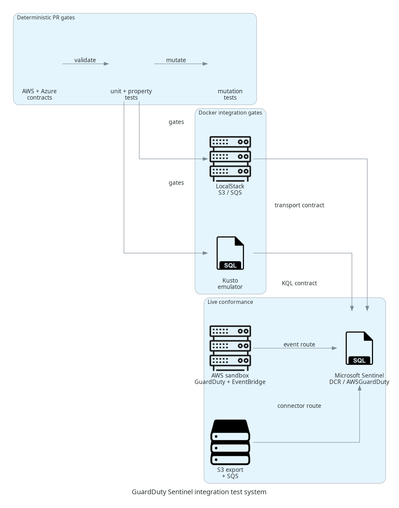

# Proposal: rigorous end-to-end test strategy

## Summary

I would like to contribute a layered test system for the GuardDuty → Microsoft
Sentinel integration. The goal is to validate both supported ingestion paths,
vendor data contracts, failure behavior, and KQL compatibility before merging
deployment or handler changes.



## Proposed coverage

- AWS GuardDuty Finding and EventBridge envelope contract fixtures
- Microsoft `AWSGuardDuty` table and DCR contract validation
- Unit and property tests for parsing, severity boundaries, UTF-8 payloads,
  batching, retries, idempotency, and Lambda async failure semantics
- LocalStack Testcontainers for S3 JSONL/GZIP and SQS notification behavior
- Kusto emulator tests for canonical KQL against the native table shape
- Mutation testing for the handler’s critical decisions
- Optional live sandbox conformance for:
  - GuardDuty → EventBridge → Lambda → Sentinel DCR
  - GuardDuty → S3 → SQS → Sentinel connector

## Maintainer guidance requested

Before opening an implementation PR, please confirm:

1. Whether this overall testing scope matches the project’s contribution goals.
2. Whether the work should land as one PR or several smaller PRs.
3. Which AWS and Azure sandbox route should be treated as the release baseline.
4. Whether the project wants the generated PNG committed or only the diagram
   source and documentation.

The detailed working plan is in [`test-strategy.md`](test-strategy.md), and the
diagram can be regenerated with:

```bash
python -m pip install -e ".[diagram]"
python scripts/generate_test_system_diagram.py
```
